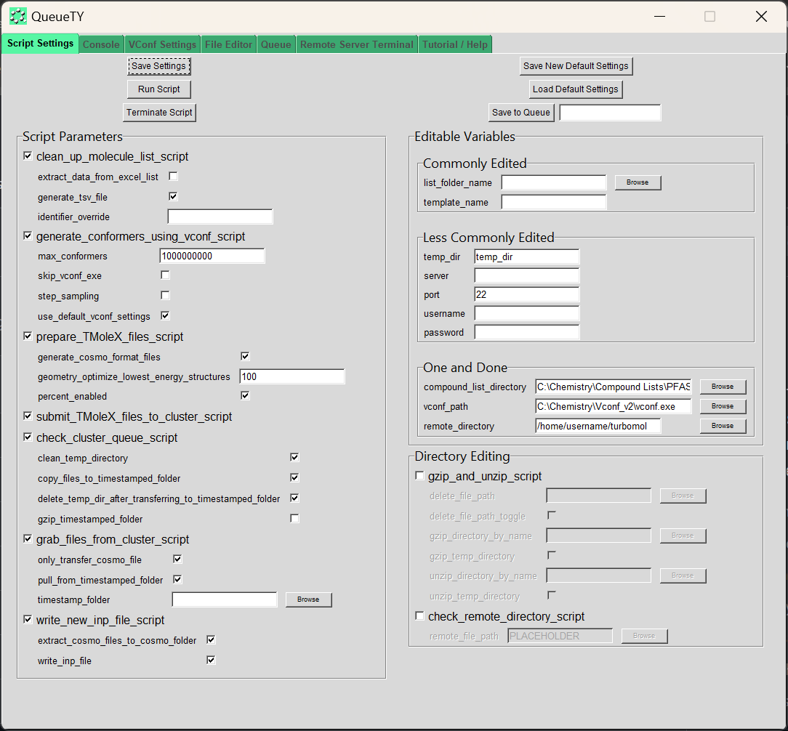
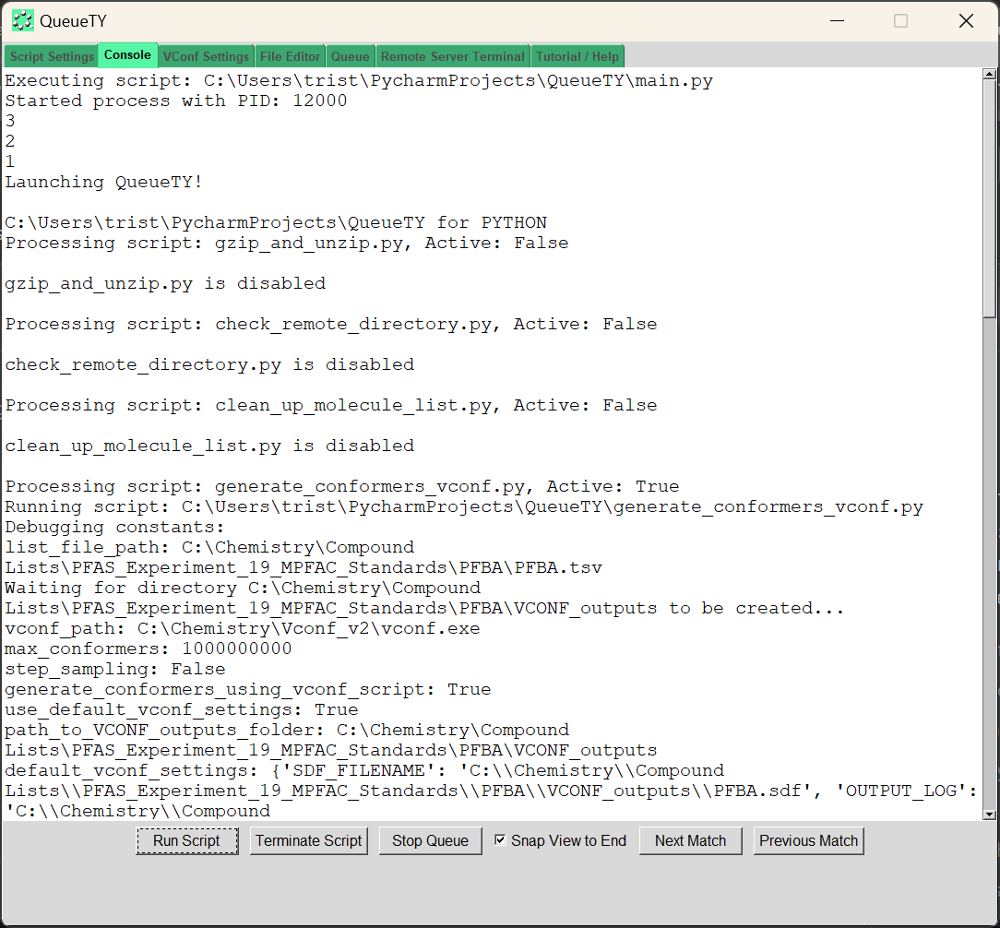
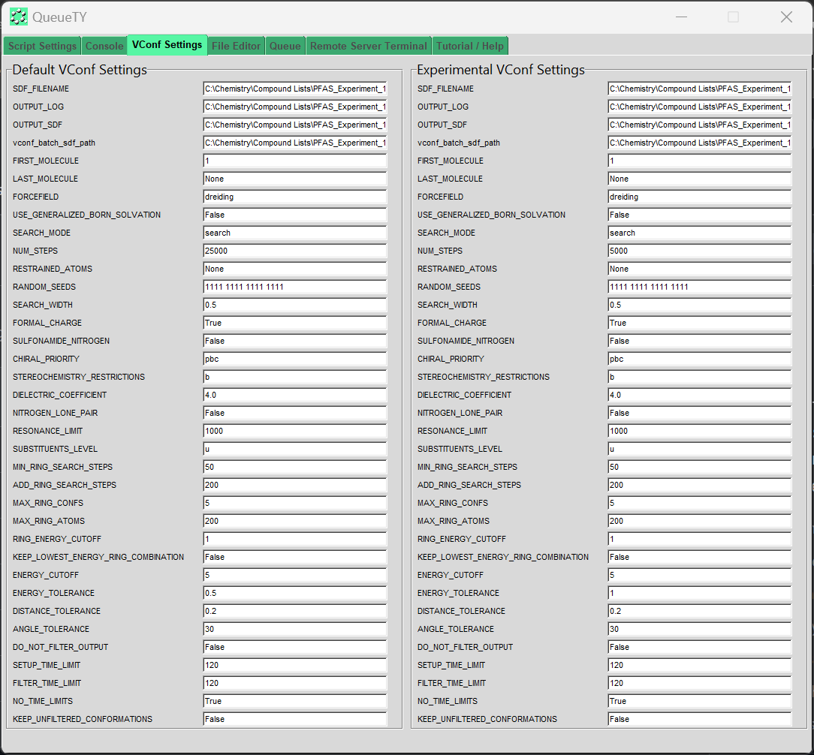
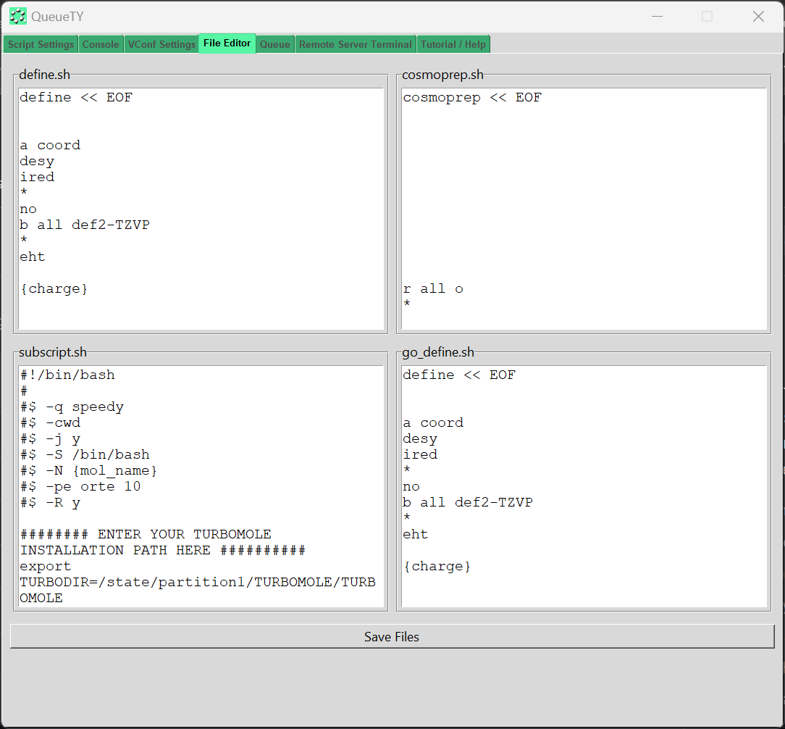
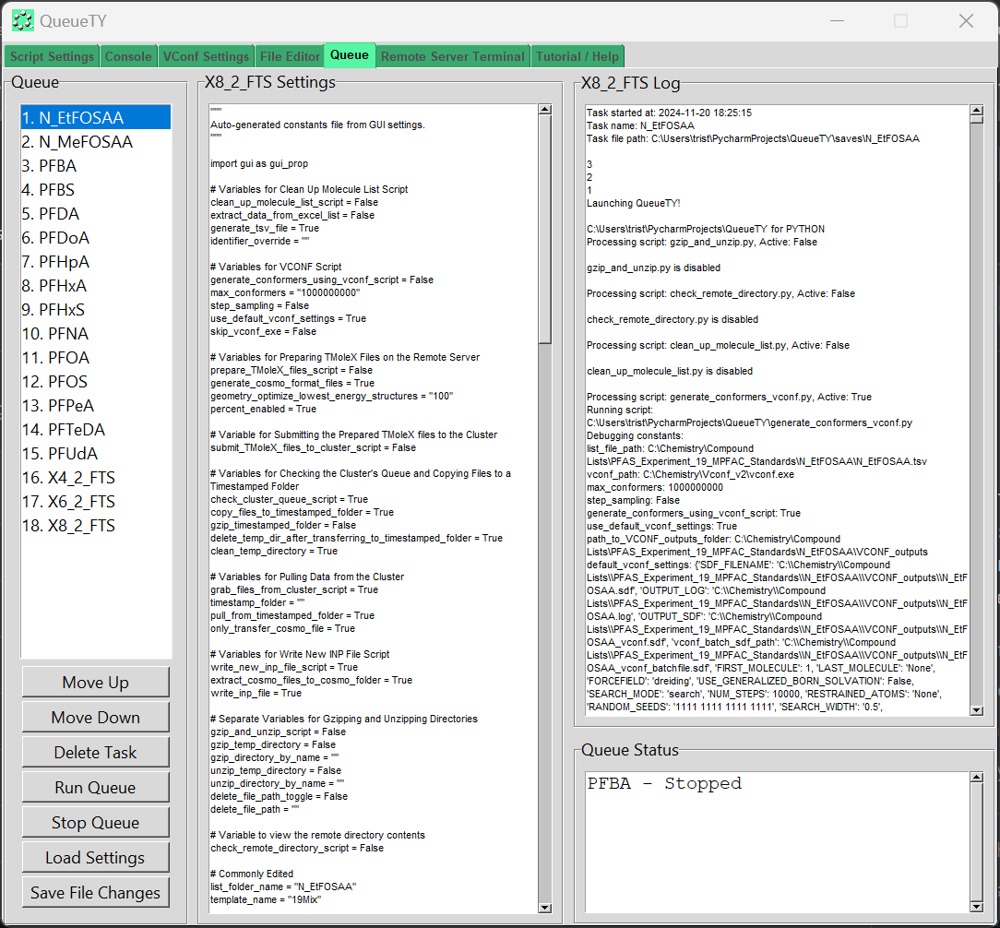
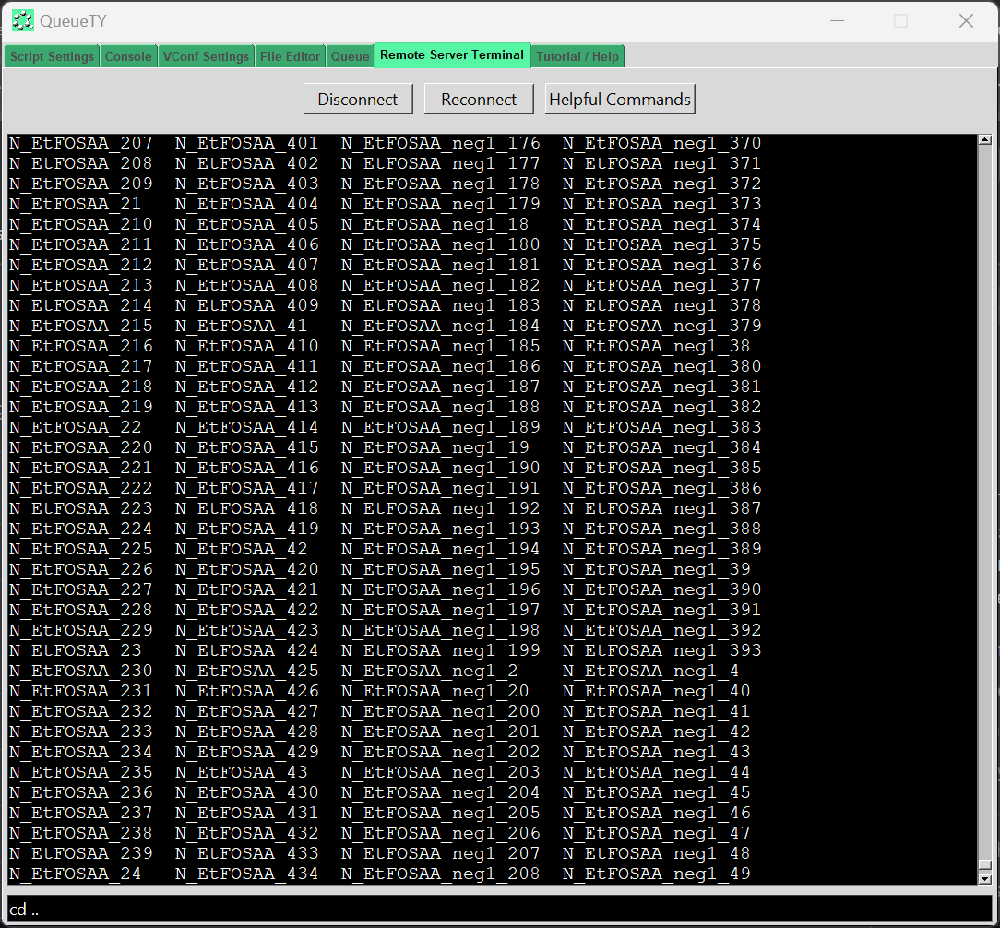
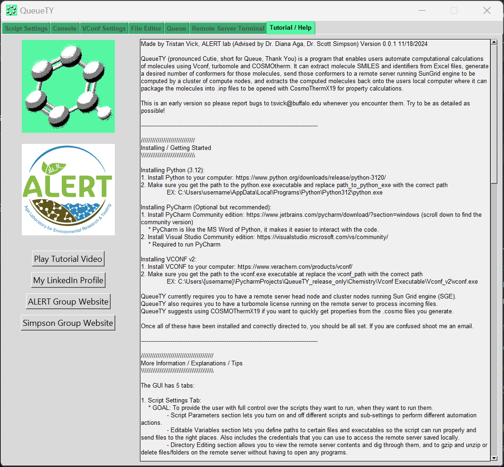

Made by Tristan Vick, ALERT lab (Advised by Dr. Diana Aga, Dr. Scott Simpson) Version 0.0.1 11/18/2024

QueueTY (pronounced Cutie, short for Queue, Thank You) is a program that enables users automate computational calculations of molecules using Vconf, turbomole and COSMOtherm. It can extract molecule SMILES and identifiers from Excel files, generate a desired number of conformers for those molecules, send those conformers to a remote server running SunGrid engine to be computed by a cluster of compute nodes, and extracts the computed molecules back onto the users local computer where it can package the molecules into .inp files to be opened with CosmoThermX19 for property calculations. 

This is an early version so please report bugs to tsvick@buffalo.edu whenever you encounter them. Try to be as detailed as possible!

-----------------------------------------------------------------------------------------------

/////////////////////////////
Installing / Getting Started
\\\\\\\\\\\\\\\\\\\\\\\\\\\\\

Installing Python (3.12):
1. Install Python to your computer: https://www.python.org/downloads/release/python-3120/
2. Make sure you get the path to the python.exe executable and replace path_to_python_exe with the correct path
	EX: C:\Users\username\AppData\Local\Programs\Python\Python312\python.exe

Installing PyCharm (Optional but recommended):
1. Install PyCharm Community edition: https://www.jetbrains.com/pycharm/download/?section=windows (scroll down to find the community version)
    * PyCharm is like the MS Word of Python, it makes it easier to interact with the code.
2. Install Visual Studio Community edition: https://visualstudio.microsoft.com/vs/community/
    * Required to run PyCharm

Installing VCONF v2:
1. Install VCONF to your computer: https://www.verachem.com/products/vconf/
2. Make sure you get the path to the vconf.exe executable at replace the vconf_path with the correct path
	EX: C:\Users\{username}\PycharmProjects\QueueTY_release_only\Chemistry\Vconf Executable\Vconf_v2\vconf.exe

QueueTY currently requires you to have a remote server head node and cluster nodes running Sun Grid engine (SGE).
QueueTY also requires you to have a turbomole license running on the remote server to process incoming files.
QueueTY suggests using COSMOThermX19 if you want to quickly get properties from the .cosmo files you generate.

Once all of these have been installed and correctly directed to, you should be all set. If you are confused shoot me an email.

-----------------------------------------------------------------------------------------------

///////////////////////////////////////
More Information / Explanations / Tips
\\\\\\\\\\\\\\\\\\\\\\\\\\\\\\\\\\\\\\\

The GUI has 5 tabs:

1. Script Settings Tab:
    * GOAL: To provide the user with full control over the scripts they want to run, when they want to run them.
	- Script Parameters section lets you turn on and off different scripts and sub-settings to perform different automation actions.
	- Editable Variables section lets you define paths to certain files and executables so the script can run properly and send files to the right places. Also includes the credentials that you can use to access the remote server saved locally.
	- Directory Editing section allows you to view the remote server contents and dig through them, and to gzip and unzip or delete files/folders on the remote server without having to open any programs.

2. Console Tab:
	* GOAL: To let you easily view the progress of your runs in real time.
	- Outputs the important script messages and tells you the progress of the scripts you’re running.
	- Provides errors and debug messages for troubleshooting.
	- Use "Ctrl + F" shortcut to enable keyword search.
	- Lets you terminate the script or the queue at any point.

3. VConf Settings Tab:
    * GOAL: To let you edit every Vconf settings individually and with explanations for each setting.
	- Lets you edit the vconf settings without opening vconf.
	- Has separate default settings and experimental settings so you can tinker easily.
	- Includes tooltips that explain what each setting does in detail (taken from Vconf documentation, linked below)

4. File Editor Tab:
    * GOAL: To let you manually provide the instructions that the remote server will follow.
	- Lets you edit:
	    - define.sh     : The non-geometry optimized define instructions.
	    - go_define.sh  : The geometry optimized define instructions.
	    - cosmoprep.sh  : The instructions to generate .cosmo files.
	    - subscript.sh  : The instructions for queueing the molecules to the SunGrid engine cluster nodes.
	- You are able to edit all of these files if you wish, but you should refer to the turbomole user manual below.

5. Queue Tab:
    * GOAL: To let you save individual experiments parameters and run them in sequence.
    - Save all of your current settings to a task file.
    - Edit the settings at any point.
    - Run multiple tasks in sequence.
    - View the console output log file for each task after the fact, as well as how long the task took to run.
    - Resize the windows to make readability better.

6. Terminal Tab:
    * GOAL: To let you interact with the remote server in a less restricted way.
    - I suggest you click "Helpful Commands" if you aren't experienced with commandline interfaces
    - Most commonly you will use these commands:
        - cd    : Change Directory          : Lets you go into and out of directories. Use "cd .." to go up a directory and "cd {directory name}" to go into a directory.
        - ls    : List Current Directory    : Lets you see whats in a directory.
        - rm    : Remove                    : Lets you delete files "rm {filename}" or directories "rm -r {directory}".
        - mkdir : Make directory            : Lets you make a new directory "mkdir {name}"
        - qstat : Checks the Cluster Queue  : More detailed breakdown is "qstat -f"
        - qdel  : Delete Job from Queue     : Use qdel {job number}

        - qstat -u "{your username}" | grep " r " | awk '{print $1}' | xargs qdel   : Deletes all of your running jobs.
        - qstat -u "{your username}" | grep " qw " | awk '{print $1}' | xargs qdel  : Deletes all of your waiting jobs.
        - qstat -u "{your username}" | grep " Eqw " | awk '{print $1}' | xargs qdel : Deletes all of the jobs that are stuck in queue.

    - DO NOT use these commands:
        - vi    : You wont be able to exit the file (hotkeys dont work)

7. Tutorial / Help Tab:
    * GOAL: To make it easier for users to get helpful information from within the GUI.
    - Includes a video tutorial.
    - Includes the README text file content.
    - Includes links to ALERT's and Simpson group's websites.
    - And of course I included a link to my LinkedIn if you're interested in contacting me.

Other Functionalities:
1. Save Default Settings / Load Default Settings:
	- If you want to save some default options like a backup while you tinker with things you can always reload them later.
2. Save on Exit:
3. Some Little Tricks (Not Exhaustive):
	- There are some tricks I added to make the script more useful.
		- For clean_up_molecule_list_script
			* If extract_data_from_excel_list is unchecked and generate_tsv_file is checked it will generate a blank TSV file in the same directory.
			* identifier_override automatically prioritized DTXSID > CAS > IUPAC > Preferred > Name if it is left blank. It will search the Excel for a column with that text in the header to auto-label the data. If you have something custom like "ID" just enter ID and it will look for a column named ID instead of following that priority.
		- For max_conformers
			* The script will always include the lowest energy conformer regardless as the first entry.
		- For step_sampling
			* Step Sampling will take the highest energy conformer and the lowest and will divide that value by the max_conformers value. It will pick out conformers every that ratio.
		- For check_cluster_queue_script
			* The script will check every 5 minutes for updates to the queue. It will take 5 minutes before it displays anything in the console, so dont worry if it just stops abruptly here.
		- For timestamped_folder
			* If timestamped_folder is left blank the script will identify the most recent timestamped folder and will extract from that if pull_from_timestamped_folder is also enabled.
		- For remote_directory
			* This must have forwards slashes (/) instead of backslashes otherwise it wont work.
		- For gzip_and_unzip_scripts
			* Enabling this will disable the other scripts to prevent any issues.
			* When you enter a directory name in any of these text boxes dont include the file type (.tar.gz or similar).
		- For remote_file_path
			* To see the contents of a directory just enable, define a path, and run the script. It should output in console file information. Correct notation is really important here.
			* Leave blank to just see the remote_directory path contents.
			* When you enter a directory name in any of these text boxes dont include the file type (.tar.gz or similar).
			* You wont be able to look inside tar.gz files.
			* If you enter a path like temp_tmole_dir/Water_1 the script will look inside of Water_1 which helps for navigating your directory.

-----------------------------------------------------------------------------------------------

///////////////////////////////////////
File Editor Tab Extras:
\\\\\\\\\\\\\\\\\\\\\\\\\\\\\\\\\\\\\\\

These files are made to mimic what it would be like to type define in Cygwin and then follow the tree of options. The text files basically send the commands for you in a specific order. Any blank lines are like hitting the Enter key. For more information use this link:

https://www.turbomole.org/wp-content/uploads/2019/10/Tutorial_7-4.pdf

or Google Turbomole documentation or Turbomole tutorial. 

///////////////////////////////////////
VCONF Settings Tab Extras:
\\\\\\\\\\\\\\\\\\\\\\\\\\\\\\\\\\\\\\\

The settings are a bit intimidating. If you would like help understanding them refer to the documentation from verachem for vconf_v2. Link provided:

https://www.verachem.com/wp-content/uploads/2013/05/vconf_v2.pdf

